# SANAD — Class Diagram

```mermaid
classDiagram

    %% ══════════════════════════════════════════════════════
    %% DATABASE ENTITIES  (PostgreSQL tables)
    %% ══════════════════════════════════════════════════════

    class Caregiver {
        +UUID id
        +String firebase_uid
        +String email
        +String first_name
        +String last_name
        +String phone
        +String photo_url
        +Boolean email_verified
        +String fcm_token
        +String status
        +Timestamp created_at
        +Timestamp updated_at
    }

    class Elderly {
        +UUID id
        +UUID caregiver_id
        +String first_name
        +String last_name
        +Date date_of_birth
        +String gender
        +String blood_type
        +String phone
        +String emergency_contact_name
        +String emergency_contact_phone
        +String medical_conditions
        +String allergies
        +String current_medications
        +String doctor_name
        +String mobility_level
        +Time typical_sleep_time
        +Time typical_wake_time
        +Boolean is_connected
        +Timestamp last_seen
        +String status
    }

    class QrToken {
        +UUID id
        +UUID elderly_id
        +String token
        +String manual_code
        +Timestamp expires_at
        +Boolean is_active
        +Timestamp used_at
        +Timestamp revoked_at
    }

    class ElderlyConnection {
        +UUID id
        +UUID elderly_id
        +UUID qr_token_id
        +Timestamp connected_at
        +Timestamp disconnected_at
        +String disconnection_reason
    }

    class SosRequest {
        +UUID id
        +UUID elderly_id
        +UUID caregiver_id
        +String status
        +String source
        +Timestamp created_at
        +Timestamp acknowledged_at
        +Timestamp escalated_at
    }

    class Event {
        +UUID id
        +UUID elderly_id
        +String event_type
        +Double confidence
        +String snapshot_url
        +JSONB pose_data
        +Boolean verified
        +Boolean is_false_positive
        +UUID verified_by
        +Boolean alert_sent
        +Timestamp created_at
    }

    class Camera {
        +UUID id
        +String camera_device_id
        +UUID elderly_id
        +String status
        +Timestamp updated_at
    }

    class ElderLocation {
        +UUID elderly_id
        +Double latitude
        +Double longitude
        +String address
        +Boolean is_home
        +Integer battery_level
        +Timestamp battery_alerted_at
        +Timestamp updated_at
    }

    class VoiceMessage {
        +UUID id
        +UUID caregiver_id
        +UUID elderly_id
        +String title
        +String file_path
        +Integer duration_secs
        +Integer used_times
        +Boolean is_saved
        +Timestamp created_at
    }

    class ElderSafeZone {
        +UUID id
        +UUID elderly_id
        +UUID caregiver_id
        +Double center_lat
        +Double center_lng
        +Integer radius_meters
        +Boolean is_active
        +Timestamp last_alerted_at
    }

    %% DB Relationships
    Caregiver "1" --> "many" Elderly : owns
    Elderly "1" --> "many" QrToken : has
    Elderly "1" --> "many" ElderlyConnection : has
    Elderly "1" --> "many" SosRequest : triggers
    Elderly "1" --> "many" Event : generates
    Elderly "1" --> "1" ElderLocation : has
    Elderly "1" --> "1" ElderSafeZone : has
    Elderly "1" --> "many" VoiceMessage : receives
    Elderly "1" --> "1" Camera : monitored_by
    QrToken "1" --> "1" ElderlyConnection : used_in
    Caregiver "1" --> "many" SosRequest : receives
    Caregiver "1" --> "many" VoiceMessage : sends

    %% ══════════════════════════════════════════════════════
    %% BACKEND SERVICES  (Node.js)
    %% ══════════════════════════════════════════════════════

    class AuthService {
        +syncUser(firebaseUid, email, firstName, lastName, emailVerified) Caregiver
        +getCaregiverByFirebaseUid(firebaseUid) Caregiver
        +updateFcmToken(caregiverId, fcmToken) void
        +updateProfile(caregiverId, data) Caregiver
        +deleteAccount(caregiverId) void
    }

    class ElderlyService {
        +create(caregiverId, data) Elderly
        +getAll(caregiverId) Elderly[]
        +getById(elderlyId) Elderly
        +update(elderlyId, data) Elderly
        +delete(elderlyId) void
        +getStats(caregiverId) Object
        +disconnectDevice(elderlyId) void
    }

    class EventsService {
        +createEvent(elderlyId, eventData) Event
        +getEventsByElderly(elderlyId, limit, offset) Event[]
        +getUnverifiedEvents(caregiverId) Event[]
        +getEventById(eventId) Event
        +verifyEvent(eventId, caregiverId, isFalsePositive) Event
        +markAlertSent(eventId) void
        +getTodayStats(elderlyId) Object
    }

    class QrService {
        +generateToken(elderlyId) QrToken
        +connectByToken(token) Object
        +connectByManualCode(code) Object
        +revokeActiveTokens(elderlyId) void
    }

    class SosService {
        +createSos(elderlyId, source) SosRequest
        +acknowledgeSos(sosId) SosRequest
        +getSosHistory(caregiverId) SosRequest[]
    }

    class NotificationService {
        +sendEventAlert(elderlyId, eventType, confidence, eventId, snapshotUrl) Object
        +sendSosAlert(elderlyId, sosId, source) Object
        +sendGeofenceAlert(elderlyId, distanceMeters) Object
        +sendBatteryAlert(elderlyId, batteryLevel) Object
        +sendSosEscalation(elderlyId, sosId, emergencyContactName) Object
        -_getCaregiverRow(elderlyId) Object
        -_send(message, logLabel) Object
        -_eventTitle(eventType) String
        -_eventBody(eventType, name, confidence) String
    }

    class MinioService {
        +uploadSnapshot(elderlyId, imageBuffer, eventType) String
        +getSignedUrl(objectName) String
        +deleteFile(objectName) void
    }

    class SocketService {
        +initializeSocket(server) void
        +emitAlert(io, caregiverId, alertData) void
        +emitSosAlert(io, caregiverId, sosData) void
    }

    %% ══════════════════════════════════════════════════════
    %% BACKEND CONTROLLERS  (Node.js)
    %% ══════════════════════════════════════════════════════

    class AuthController {
        +syncUser(req, res) void
        +getMe(req, res) void
        +updateProfile(req, res) void
        +updateFcmToken(req, res) void
        +deleteAccount(req, res) void
        +checkEmail(req, res) void
    }

    class ElderlyController {
        +create(req, res) void
        +getAll(req, res) void
        +getById(req, res) void
        +getWithQR(req, res) void
        +update(req, res) void
        +deleteElderly(req, res) void
        +disconnectDevice(req, res) void
        +regenerateQR(req, res) void
        +getStats(req, res) void
    }

    class EventsController {
        +createEvent(req, res) void
        +getEventsByElderly(req, res) void
        +getUnverifiedEvents(req, res) void
        +verifyEvent(req, res) void
        +getEventById(req, res) void
        +getNotifications(req, res) void
        +getTodayStats(req, res) void
    }

    class QrController {
        +connectByQR(req, res) void
        +connectByManual(req, res) void
        +verifyQR(req, res) void
    }

    class SosController {
        +triggerSos(req, res) void
        +acknowledgeSos(req, res) void
        +getSosHistory(req, res) void
    }

    %% Controller → Service dependencies
    AuthController ..> AuthService : uses
    ElderlyController ..> ElderlyService : uses
    EventsController ..> EventsService : uses
    EventsController ..> NotificationService : uses
    EventsController ..> SocketService : uses
    QrController ..> QrService : uses
    SosController ..> SosService : uses
    SosController ..> NotificationService : uses
    SosController ..> SocketService : uses
    EventsService ..> MinioService : uses
    NotificationService ..> Caregiver : queries

    %% ══════════════════════════════════════════════════════
    %% BACKEND UTILS
    %% ══════════════════════════════════════════════════════

    class ApiError {
        +Integer statusCode
        +String message
        +Boolean isOperational
        +ApiError(statusCode, message)
    }

    class ApiResponse {
        +Integer statusCode
        +Boolean success
        +String message
        +Object data
        +ApiResponse(statusCode, data, message)
    }

    %% ══════════════════════════════════════════════════════
    %% BACKEND CRON JOBS
    %% ══════════════════════════════════════════════════════

    class SosEscalationJob {
        +run() void
        <<cron every 1 min>>
    }

    class QrExpiryJob {
        +run() void
        <<cron every 1 hour>>
    }

    class OfflineDetectionJob {
        +run() void
        <<cron every 15 min>>
    }

    class DeviceHealthJob {
        +run() void
        <<cron every 6 hours>>
    }

    class DataCleanupJob {
        +run() void
        <<cron daily 2AM>>
    }

    SosEscalationJob ..> NotificationService : uses
    SosEscalationJob ..> SosRequest : queries

    %% ══════════════════════════════════════════════════════
    %% FLUTTER MODELS
    %% ══════════════════════════════════════════════════════

    class ElderlyModel {
        +String id
        +String caregiverId
        +String firstName
        +String lastName
        +DateTime dateOfBirth
        +String gender
        +String bloodType
        +String emergencyContactName
        +String emergencyContactPhone
        +String medicalConditions
        +String mobilityLevel
        +String typicalSleepTime
        +String typicalWakeTime
        +Boolean isConnected
        +DateTime lastSeen
        +String get fullName()
        +fromJson(json) ElderlyModel
        +toRequestBody(formData) Map
    }

    class QrModel {
        +String id
        +String elderlyId
        +String token
        +String manualCode
        +Boolean isActive
        +DateTime expiresAt
        +String qrCodeImage
        +Boolean get isValid()
        +Integer get remainingMinutes()
        +fromJson(json) QrModel
    }

    class LocationModel {
        +Double latitude
        +Double longitude
        +String address
        +DateTime lastUpdated
        +Boolean isHome
        +Integer batteryLevel
        +String get lastSeenLabel()
        +fromJson(json) LocationModel
        +toJson() Map
    }

    class VoiceReminder {
        +String id
        +String title
        +String filePath
        +Integer usedTimes
        +DateTime createdAt
        +fromJson(json) VoiceReminder
        +toJson() Map
    }

    %% ══════════════════════════════════════════════════════
    %% FLUTTER SERVICES
    %% ══════════════════════════════════════════════════════

    class ApiService {
        +get(url) Future~Map~
        +post(url, body) Future~Map~
        +put(url, body) Future~Map~
        +delete(url) Future~Map~
        -_getAuthHeader() Future~Map~
    }

    class LocationService {
        +reportLocation(elderlyId, caregiverId) Future~bool~
        -_tryGetPosition(accuracy, timeout) Future~Position~
    }

    class SosService_Flutter {
        +triggerSos(elderlyId) Future~Map~
        +acknowledgeSos(sosId) Future~void~
        +getSosHistory() Future~List~
    }

    class VoiceReminderService {
        +getReminders(elderlyId) Future~List~
        +createReminder(elderlyId, title, filePath, duration) Future~Map~
        +sendReminder(reminderId, elderlyId) Future~void~
        +deleteReminder(reminderId) Future~void~
    }

    class WebRTCService {
        +initializePeerConnection() Future~void~
        +createOffer() Future~Map~
        +handleAnswer(answer) Future~void~
        +addIceCandidate(candidate) Future~void~
        +dispose() void
    }

    %% ══════════════════════════════════════════════════════
    %% PYTHON AI MODULE
    %% ══════════════════════════════════════════════════════

    class FallDetector {
        -landmarker : PoseLandmarker
        -fall_start_time : float
        -last_positions : deque
        -last_alert_time : float
        -sleep_schedule : Object
        +analyze_fall(landmarks) Tuple
        +analyze_inactivity(landmarks) Tuple
        +analyze_sleeping(landmarks) Tuple
        +process_frame(frame) Tuple
        +run() void
    }

    class AlertSender {
        +send_event(elderly_id, event_type, confidence, snapshot_b64, pose_data) Response
        +register_camera(camera_device_id, elderly_id) Response
    }

    class WebRTCStreamer {
        -pc : RTCPeerConnection
        -socket : SocketIO
        -frame_queue : Queue
        +connect(elderly_id, caregiver_id) void
        +send_frame(frame) void
        +handle_offer(offer) void
        +disconnect() void
    }

    class CameraCapture {
        -cap : VideoCapture
        -frame_width : int
        -frame_height : int
        +read_frame() ndarray
        +release() void
    }

    class ScheduleChecker {
        +fetch_sleep_schedule(elderly_id) Object
        +is_sleep_time(schedule) Boolean
    }

    class Config {
        +SERVER_URL : String
        +ELDERLY_ID : String
        +CAMERA_INDEX : int
        +FALL_CONFIDENCE : float
        +INACTIVITY_CONFIDENCE : float
        +SLEEP_CONFIDENCE : float
        +ALERT_COOLDOWN_SECONDS : int
    }

    FallDetector ..> AlertSender : sends alerts via
    FallDetector ..> ScheduleChecker : checks schedule via
    FallDetector ..> CameraCapture : reads frames from
    FallDetector ..> Config : reads settings from
    WebRTCStreamer ..> CameraCapture : streams frames from
    AlertSender ..> Config : reads SERVER_URL from
```



---

## Architecture Overview

```
┌─────────────────────────────────────────────────────────────┐
│                    Flutter Mobile App                        │
│  Caregiver Side              │  Elder Side                   │
│  CaregiverHomeScreen         │  HomeElderPage                │
│  GeofencingScreen            │  QrScannerPage                │
│  CameraAlertsScreen          │  SosCallScreen                │
│  VoiceReminderScreen         │  ElderSettingsScreen          │
└──────────────┬───────────────┴──────────────┬───────────────┘
               │  REST API + Socket.IO         │  REST API
               ▼                               ▼
┌─────────────────────────────────────────────────────────────┐
│              Node.js / Express Backend (port 3000)           │
│  Controllers → Services → PostgreSQL                         │
│  NotificationService → Firebase FCM                          │
│  MinioService        → MinIO object storage                  │
│  SocketService       → Socket.IO real-time                   │
│  CronJobs: SOS escalation, QR expiry, offline detection      │
└──────────────┬──────────────────────────────────────────────┘
               │  POST /api/v1/events
               ▼
┌─────────────────────────────────────────────────────────────┐
│              Python AI Module (sanad-python)                  │
│  CameraCapture → FallDetector → AlertSender                  │
│  WebRTCStreamer → Socket.IO → CaregiverApp (live stream)     │
│  ScheduleChecker → respects elder sleep/wake schedule        │
└─────────────────────────────────────────────────────────────┘
```
