# SANAD — Class Diagram

> **Editable draw.io file:** `CLASS_DIAGRAM.drawio`  
> Regenerate it anytime: `python3 generate_class_drawio.py`

```mermaid
classDiagram

    %% ══════════════════════════════════════════════
    %% DATABASE ENTITIES  (PostgreSQL)
    %% ══════════════════════════════════════════════

    class Caregiver {
        +UUID id
        +String firebase_uid
        +String email
        +String first_name
        +String last_name
        +String phone
        +String fcm_token
        +String status
        +Timestamp created_at
    }

    class Elderly {
        +UUID id
        +UUID caregiver_id
        +String first_name
        +String last_name
        +Date date_of_birth
        +String gender
        +String blood_type
        +String medical_conditions
        +String allergies
        +String mobility_level
        +Time typical_sleep_time
        +Time typical_wake_time
        +Boolean is_connected
        +String status
    }

    class Event {
        +UUID id
        +UUID elderly_id
        +String event_type
        +String event_type_values
        +Double confidence
        +String snapshot_url
        +JSONB pose_data
        +Boolean verified
        +Boolean is_false_positive
        +Boolean alert_sent
        +Timestamp created_at
    }

    class SosRequest {
        +UUID id
        +UUID elderly_id
        +UUID caregiver_id
        +String status
        +String source
        +Timestamp created_at
        +Timestamp acknowledged_at
    }

    class Camera {
        +UUID id
        +String camera_device_id
        +UUID elderly_id
        +String status
        +Timestamp updated_at
    }

    class ElderLocation {
        +UUID elderly_id
        +Double latitude
        +Double longitude
        +String address
        +Boolean is_home
        +Integer battery_level
        +Timestamp last_seen
        +Timestamp updated_at
    }

    class ElderSafeZone {
        +UUID id
        +UUID elderly_id
        +Double center_lat
        +Double center_lng
        +Integer radius_meters
        +Boolean is_active
        +Timestamp last_alerted_at
    }

    class VoiceMessage {
        +UUID id
        +UUID caregiver_id
        +UUID elderly_id
        +String title
        +String file_path
        +Integer duration_secs
        +Integer used_times
        +Boolean is_saved
        +Timestamp created_at
    }

    class QrToken {
        +UUID id
        +UUID elderly_id
        +String token
        +String manual_code
        +Timestamp expires_at
        +Boolean is_active
        +Timestamp used_at
        +Timestamp revoked_at
    }

    class ElderlyConnection {
        +UUID id
        +UUID elderly_id
        +UUID qr_token_id
        +Timestamp connected_at
        +Timestamp disconnected_at
        +String disconnection_reason
    }

    %% ══════════════════════════════════════════════
    %% PILLBOX TABLES  (new)
    %% ══════════════════════════════════════════════

    class PillSlot {
        +UUID id
        +UUID elderly_id
        +Integer slot_number
        +String medication_name
        +String notes
        +Boolean is_active
        +Timestamp created_at
        +Timestamp updated_at
    }

    class PillSchedule {
        +UUID id
        +UUID slot_id
        +UUID elderly_id
        +Time scheduled_time
        +Integer[] days_of_week
        +Boolean is_active
        +Timestamp created_at
    }

    class PillLog {
        +UUID id
        +UUID schedule_id
        +UUID elderly_id
        +String status
        +Timestamp taken_at
        +Boolean notified
        +Timestamp created_at
    }

    class PillboxDevice {
        +UUID id
        +UUID elderly_id
        +String mac_address
        +Timestamp last_seen
        +Timestamp created_at
    }

    %% DB Relationships
    Caregiver "1" --> "many" Elderly : owns
    Elderly "1" --> "many" Event : generates
    Elderly "1" --> "many" SosRequest : triggers
    Elderly "1" --> "1" Camera : monitored_by
    Elderly "1" --> "1" ElderLocation : has
    Elderly "1" --> "1" ElderSafeZone : has
    Elderly "1" --> "many" VoiceMessage : receives
    Elderly "1" --> "many" QrToken : has
    QrToken "1" --> "1" ElderlyConnection : used_in
    Elderly "1" --> "3" PillSlot : has
    PillSlot "1" --> "many" PillSchedule : schedules
    PillSchedule "1" --> "many" PillLog : logs
    Elderly "1" --> "1" PillboxDevice : uses

    %% ══════════════════════════════════════════════
    %% BACKEND SERVICES  (Node.js)
    %% ══════════════════════════════════════════════

    class AuthService {
        +syncUser(uid, email, name) Caregiver
        +getCaregiverByUid(uid) Caregiver
        +updateFcmToken(id, token) void
        +updateProfile(id, data) Caregiver
        +deleteAccount(id) void
    }

    class ElderlyService {
        +create(caregiverId, data) Elderly
        +getAll(caregiverId) Elderly[]
        +getById(elderlyId) Elderly
        +update(elderlyId, data) Elderly
        +delete(elderlyId) void
        +disconnectDevice(elderlyId) void
        +getStats(caregiverId) Object
    }

    class EventsService {
        +createEvent(elderlyId, data) Event
        +getEventsByElderly(id) Event[]
        +getUnverifiedEvents(cgId) Event[]
        +verifyEvent(id, cgId, fp) Event
        +markAlertSent(eventId) void
        +getTodayStats(elderlyId) Object
    }

    class SosService {
        +createSos(elderlyId, source) Sos
        +acknowledgeSos(sosId) Sos
        +getSosHistory(caregiverId) Sos[]
    }

    class NotificationService {
        +sendEventAlert(id, type, conf, eventId, url)
        +sendSosAlert(id, sosId, source)
        +sendGeofenceAlert(id, distMeters)
        +sendBatteryAlert(id, level)
        +sendRawNotification(token, msg)
    }

    class MinioService {
        +uploadSnapshot(id, buf, type) String
        +getSignedUrl(objectName) String
        +deleteFile(objectName) void
    }

    class SocketService {
        +initializeSocket(server) void
        +emitAlert(io, cgId, data) void
        +emitSosAlert(io, cgId, data) void
    }

    class PillboxService {
        +getSlots(elderlyId) PillSlot[]
        +updateSlot(id, slotNo, data) void
        +addSchedule(slotId, data) void
        +updateSchedule(id, data) void
        +deleteSchedule(id) void
        +getTodaySchedule(elderlyId) Object
        +upsertLog(schedId, status) void
        +markNotified(schedId, date) void
        +getLogs(elderlyId) PillLog[]
        +registerDevice(mac, elderlyId) void
        +getElderlyByMac(mac) Object
        +getCaregiverFcm(elderlyId) String
    }

    %% ══════════════════════════════════════════════
    %% BACKEND CONTROLLERS  (Node.js)
    %% ══════════════════════════════════════════════

    class AuthController {
        +syncUser(req, res) void
        +getMe(req, res) void
        +updateProfile(req, res) void
        +updateFcmToken(req, res) void
        +deleteAccount(req, res) void
        +checkEmail(req, res) void
    }

    class ElderlyController {
        +create(req, res) void
        +getAll(req, res) void
        +getById(req, res) void
        +getWithQR(req, res) void
        +update(req, res) void
        +deleteElderly(req, res) void
        +disconnectDevice(req, res) void
        +regenerateQR(req, res) void
        +getStats(req, res) void
    }

    class EventsController {
        +createEvent(req, res) void
        +getEventsByElderly(req, res) void
        +getUnverifiedEvents(req, res) void
        +verifyEvent(req, res) void
        +getNotifications(req, res) void
        +getTodayStats(req, res) void
    }

    class SosController {
        +triggerSos(req, res) void
        +acknowledgeSos(req, res) void
        +getSosHistory(req, res) void
    }

    class QrController {
        +connectByQR(req, res) void
        +connectByManual(req, res) void
        +verifyQR(req, res) void
    }

    class PillboxController {
        +getSlots(req, res) void
        +updateSlot(req, res) void
        +addSchedule(req, res) void
        +updateSchedule(req, res) void
        +deleteSchedule(req, res) void
        +getLogs(req, res) void
        +getTodaySchedule(req, res) void
        +registerDevice(req, res) void
        +getDeviceSchedule(req, res) void
        +reportDose(req, res) void
    }

    %% Controller → Service
    AuthController ..> AuthService : uses
    ElderlyController ..> ElderlyService : uses
    EventsController ..> EventsService : uses
    EventsController ..> NotificationService : uses
    EventsController ..> SocketService : uses
    SosController ..> SosService : uses
    SosController ..> NotificationService : uses
    SosController ..> SocketService : uses
    PillboxController ..> PillboxService : uses
    EventsService ..> MinioService : uses

    %% ══════════════════════════════════════════════
    %% PYTHON AI MODULE  (sanad-python)
    %% ══════════════════════════════════════════════

    class Detector {
        -detector PoseLandmarker
        -alert_sender AlertSender
        -state DetectionState
        -timestamp_ms int
        -wake_hour int
        -sleep_hour int
        +process_frame(frame) annotated
        +_check_fall(landmarks, frame)
        +_check_inactivity(landmarks, frame)
        +_check_sleeping(landmarks, frame)
        +_check_night_restlessness(frame)
        +close() void
    }

    class DetectionState {
        +fall_start_time float
        +fall_counted bool
        +last_fall_time float
        +posture_history deque_maxlen60
        +last_movement_time float
        +prev_keypoints ndarray
        +prev_frame ndarray
        +last_inactivity_warning_time float
        +last_inactivity_critical_time float
        +night_restlessness_start float
        +last_restlessness_alert_time float
        +sleep_start_time float
    }

    class analyze_fall {
        Rule1_torso_horizontal 45pct
        Rule2_legs_collapsed 30pct
        Rule3_head_at_torso 15pct
        Rule4_velocity_bonus 10pct
        threshold 0_65
        posture_history deque_for_velocity
    }

    class detect_inactivity {
        frame_diff_pixel_count gt30
        gt30min_warning 0_75_conf
        gt2hrs_critical 0_90_conf
        returns is_alert_conf_reason
    }

    class AlertSender {
        -server_url String
        -elderly_id String
        -camera_device_id String
        +send_event(type, conf, frame, pose)
        +fetch_elderly_id(cam_device_id)
    }

    class WebRTCStreamer {
        -pc RTCPeerConnection
        -socket SocketIO
        -frame_queue Queue
        +connect(elderly_id, cg_id)
        +send_frame(frame)
        +disconnect()
    }

    class Config {
        +SERVER_URL String
        +ELDERLY_ID String
        +FALL_CONFIRMATION_SECONDS 1_5
        +INACTIVITY_WARNING_SECONDS 1800
        +INACTIVITY_CRITICAL_SECONDS 7200
        +INACTIVITY_ALERT_COOLDOWN 900
        +FRAME_DIFF_MOVEMENT_THRESHOLD 1000
        +NIGHT_RESTLESSNESS_THRESHOLD 5000
        +NIGHT_RESTLESSNESS_DURATION 120
        +FALL_CONFIDENCE 0_90
        +INACTIVITY_WARNING_CONFIDENCE 0_75
        +INACTIVITY_CRITICAL_CONFIDENCE 0_90
        +NIGHT_RESTLESSNESS_CONFIDENCE 0_80
        +SLEEP_CONFIDENCE 0_80
        +ALERT_COOLDOWN_SECONDS 60
    }

    Detector *-- DetectionState : has
    Detector ..> AlertSender : alerts via
    Detector ..> analyze_fall : calls
    Detector ..> detect_inactivity : calls
    Detector ..> Config : reads
    AlertSender ..> Config : reads SERVER_URL
    WebRTCStreamer ..> Config : reads

    %% ══════════════════════════════════════════════
    %% FLUTTER MODELS & SERVICES
    %% ══════════════════════════════════════════════

    class ElderlyModel {
        +String id
        +String caregiverId
        +String firstName
        +String lastName
        +DateTime dateOfBirth
        +String medicalConditions
        +String mobilityLevel
        +String typicalSleepTime
        +String typicalWakeTime
        +Boolean isConnected
        +String get_fullName()
        +fromJson(json) ElderlyModel
        +toRequestBody() Map
    }

    class EventModel {
        +String id
        +String elderlyId
        +String elderlyName
        +String eventType
        +double confidence
        +String snapshotUrl
        +bool verified
        +bool isFalsePositive
        +DateTime createdAt
        +String get_title()
        +String get_confidencePercent()
        +String get_timeAgo()
        +fromJson(json) EventModel
    }

    class TodayStats {
        +int falls
        +int inactivity
        +int sleeping
        +int nightRestlessness
        +int total
        +String get_activityLevel()
    }

    class QrModel {
        +String id
        +String elderlyId
        +String token
        +String manualCode
        +bool isActive
        +DateTime expiresAt
        +bool get_isValid()
        +int get_remainingMinutes()
        +fromJson(json) QrModel
    }

    class LocationModel {
        +double latitude
        +double longitude
        +String address
        +DateTime lastUpdated
        +bool isHome
        +int batteryLevel
        +String get_lastSeenLabel()
        +fromJson(json) LocationModel
        +toJson() Map
    }

    class WebRTCService_Flutter {
        -String caregiverId
        -String elderlyId
        -Function onConnected
        -Function onDisconnected
        -Function onAlert
        -Function onCameraOffline
        +connect() void
        +disconnect() void
        +createOffer() Map
        +handleAnswer(answer) void
    }

    class LocationService_Flutter {
        +reportLocation(elderlyId) bool
        +startPeriodicReporting() void
        +stopReporting() void
    }

    class SosService_Flutter {
        +triggerSos(elderlyId) Map
        +acknowledgeSos(sosId) void
        +getSosHistory() List
    }

    class VoiceReminderService {
        +getReminders(elderlyId) List
        +createReminder(id, title, path) Map
        +sendReminder(reminderId, eldId) void
        +deleteReminder(reminderId) void
    }

    TodayStats ..> EventModel : built from
```



---

## Architecture Overview

```
┌─────────────────────────────────────────────────────────────────┐
│                      Flutter Mobile App                          │
│  Caregiver Side                  │  Elder Side                   │
│  CaregiverHomeScreen             │  HomeElderPage                │
│  LiveCameraScreen                │  QrScannerPage                │
│  CameraAlertsScreen              │  SosCallScreen                │
│  ManagePillsScreen  ← new        │  ElderSettingsScreen          │
│  GeofencingScreen                │                               │
│  VoiceReminderScreen             │                               │
└──────────────┬────────────────────────────────┬─────────────────┘
               │  REST API + Socket.IO           │  REST API
               ▼                                 ▼
┌─────────────────────────────────────────────────────────────────┐
│              Node.js / Express Backend  (port 3000)              │
│                                                                   │
│  Controllers → Services → PostgreSQL                             │
│  EventsController  allows: fall | inactivity | sleeping          │
│                            night_restlessness  ← new             │
│  PillboxController  (caregiver + ESP32 routes) ← new             │
│                                                                   │
│  NotificationService → Firebase FCM                              │
│  MinioService        → MinIO object storage                      │
│  SocketService       → Socket.IO real-time                       │
│                                                                   │
│  CronJobs: SOS escalation, QR expiry, offline detection          │
└──────────────┬──────────────────────────────────────────────────┘
               │  POST /api/v1/events
               │  POST /api/v1/pillbox/report-dose  ← new (ESP32)
               ▼
┌─────────────────────────────────────────────────────────────────┐
│              Python AI Module  (sanad-python)                     │
│                                                                   │
│  Detector                                                         │
│  ├─ _check_fall()          velocity-aware (posture_history)      │
│  ├─ _check_inactivity()    keypoint + frame-diff, tiered         │
│  │   ├─ 30 min warning     (conf 0.75)                           │
│  │   └─ 2 hr critical      (conf 0.90)                           │
│  ├─ _check_sleeping()      slow-transition guard                  │
│  └─ _check_night_restlessness()  sustained movement in sleep hrs  │
│                                                                   │
│  AlertSender  → polls /dev/camera-device/:id for elderly_id      │
│  WebRTCStreamer → Socket.IO → CaregiverApp (live stream)         │
└─────────────────────────────────────────────────────────────────┘
               │
               ▼
┌─────────────────────────────────────────────────────────────────┐
│              ESP32 Smart Pillbox  (sanad-esp32)  ← new           │
│  WiFi + NTP sync → poll schedules → IR detect → report dose      │
│  3 slots × LED + buzzer  |  30-min reminder window              │
└─────────────────────────────────────────────────────────────────┘
```
